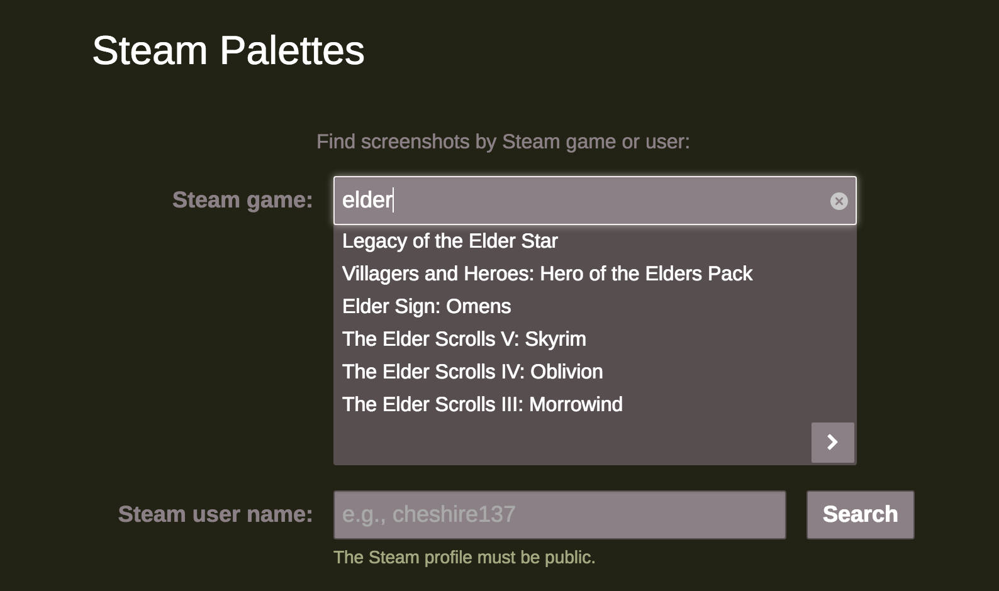
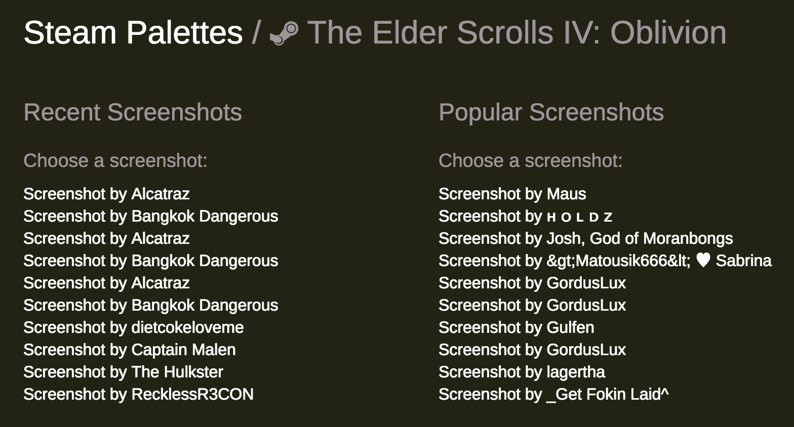
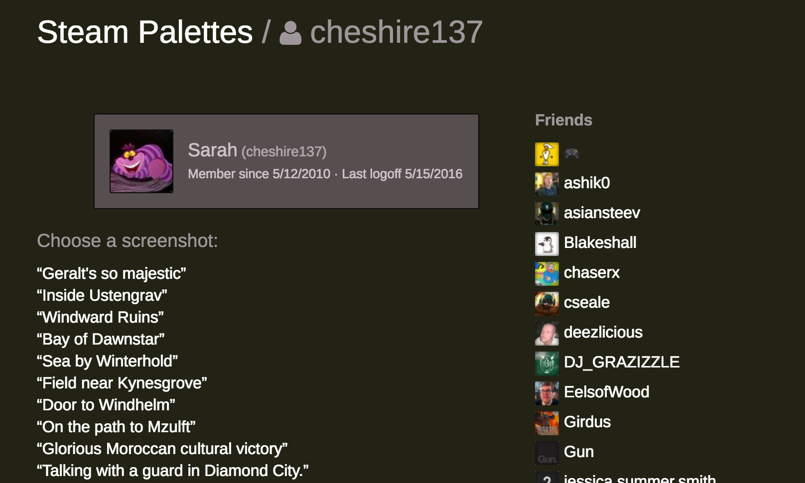
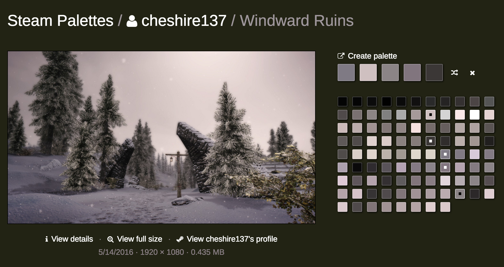

# Steam Palettes

This is the successor to [steamy-screenshots](https://github.com/cheshire137/steamy-screenshots), built as a React web app. The goal is to let you view Steam screenshots and create color palettes from them on [COLOURlovers](http://www.colourlovers.com/).

## How to Run

    cp src/env.sh.example src/env.sh

Get a [Steam Web API key](http://steamcommunity.com/dev/apikey) and add it to src/env.sh.

    brew install cairo
    npm install
    npm start

Visit [localhost:3000](http://localhost:3000/) to view the app. The server runs on port 5000.

### How to Update the List of Steam Apps

    npm run-script update-steam-apps

## How to Deploy to Heroku

1. Fork this repo and modify src/config.json to suit your app.
1. Create your app on Heroku.
1. `git remote add heroku git@heroku.com:yourherokuapp.git`
1. `heroku buildpacks:set https://github.com/mojodna/heroku-buildpack-cairo.git`
1. `heroku buildpacks:add heroku/nodejs`
1. `./deploy.sh`
1. `heroku ps:scale web=1`
1. `heroku config:set STEAM_API_KEY="your Steam Web API Key"`

## Thanks

- [itunes-colors](https://github.com/lukasklein/itunes-colors) and [Color Thief](https://github.com/lokesh/color-thief) for extracting color palettes from images.
- [TinyColor](https://github.com/bgrins/TinyColor) for translating between RGB and hex colors as well as getting analogous and monochromatic color variations.
